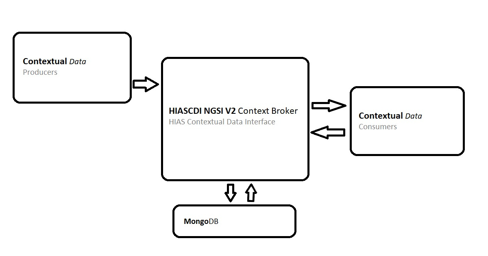

# Asociación de Investigacion en Inteligencia Artificial Para la Leucemia Peter Moss
# HIAS - Hospital Intelligent Automation Server
## HIASCDI - HIAS Contextual Data Interface

     

&nbsp;

# Table Of Contents

- [Introduction](#introduction)
  - [HIAS](#hias)
  - [Connecting Europe Facility](#connecting-europe-facility)
- [GETTING STARTED](#getting-started)
- [Documenation](#documentation)
- [Contributing](#contributing)
  - [Contributors](#contributors)
- [Versioning](#versioning)
- [License](#license)
- [Bugs/Issues](#bugs-issues)

&nbsp;

# Introduction

**HIASCDI** is the **Hospital Intelligent Automation Server Contextual Data Interface**. HIASCDI is an implementation of a [CEF Context Broker (NGSI v2)](https://fiware.github.io/specifications/ngsiv2/stable/). A context broker stores contextual data and serves it to applications by exposing the data through a REST API and pushing data through subscriptions.

&nbsp;

# HIAS

[HIAS - Hospital Intelligent Automation Server](https://github.com/AIIAL/HIAS-Server) is an open-source automation server designed to control and manage an intelligent network of IoT connected devices and applications.

In addition to real-time and historical data, the HIAS network is powered by contextual data. HIAS users, IoT devices, robotics, AI agents and other HIAS compatible projects each have a JSON representation stored in HIASCDI. These JSON representations are made up of contextual data which represent the current state of the physical/virtual entity.

HIAS devices and applications are the **contextual data producers** for the HIAS network. These devices and applications publish data to the context broker using supported machine to machine communication protocols and the REST API.

HIAS devices and applications are also the **contextual data consumers**. Devices and applications connected to the network consume contextual data generated by the network.

&nbsp;

# Connecting Europe Facility

We are proud to be collaborating with the [Connecting Europe Facility (CEF/CEF Digital)](https://ec.europa.eu/cefdigital/wiki/display/CEFDIGITAL/CEF+Digital+Home) for the HIAS/HIASCDI project. CEF is a European Union initiative facilitating the delivery of digital public services across Europe.

HIASCDI has been developed to be compliant with the [NGSI v2 specification](https://fiware.github.io/specifications/ngsiv2/stable/). With the support and guidance of CEF and FIWARE we are working towards interoperability and EU-compliance for HIAS/HIASCDI.

&nbsp;

# GETTING STARTED

Ready to get started ? Head over to the [Getting Started guide](documentation/getting-started.md) for instructions on how to download/install and setup the HIAS - Hospital Intelligent Automation Server.

&nbsp;

# Documenation

- [Installation](installation/)
	- [Ubuntu](installation/ubuntu.md)
- [Usage](usage/)
	- [API](usage/api.md)
	- [Console](usage/console.md)

&nbsp;

# Contributing
The Asociación de Investigacion en Inteligencia Artificial Para la Leucemia Peter Moss encourages and welcomes code contributions, bug fixes and enhancements from the Github community.

Please read the [CONTRIBUTING](CONTRIBUTING.md "CONTRIBUTING") document for a full guide to forking our repositories and submitting your pull requests. You will also find information about our code of conduct on this page.

## Contributors
- [Adam Milton-Barker](https://www.leukemiaairesearch.com/association/volunteers/adam-milton-barker "Adam Milton-Barker") - [Asociación de Investigacion en Inteligencia Artificial Para la Leucemia Peter Moss](https://www.leukemiaresearchassociation.ai "Asociación de Investigacion en Inteligencia Artificial Para la Leucemia Peter Moss") President/Founder & Lead Developer, Sabadell, Spain

&nbsp;

# Versioning
We use SemVer for versioning.

&nbsp;

# License
This project is licensed under the **MIT License** - see the [LICENSE](LICENSE "LICENSE") file for details.

&nbsp;

# Bugs/Issues
We use the [repo issues](issues "repo issues") to track bugs and general requests related to using this project. See [CONTRIBUTING](CONTRIBUTING.md "CONTRIBUTING") for more info on how to submit bugs, feature requests and proposals.