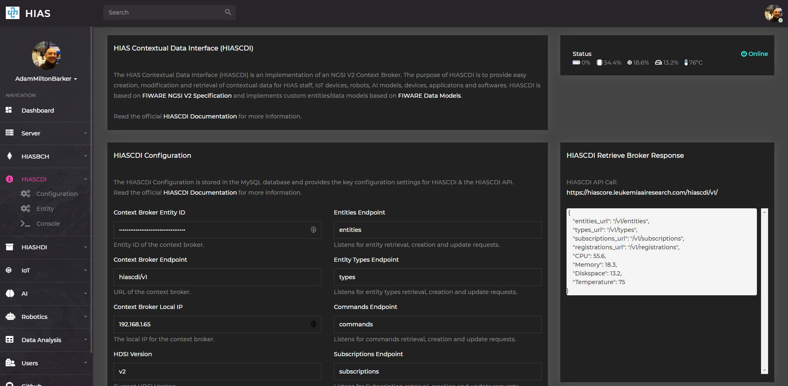
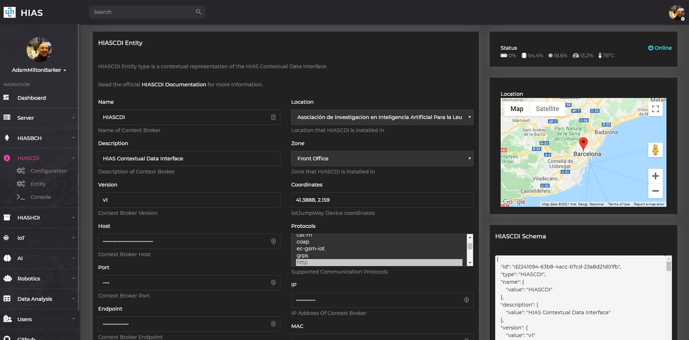

# Asociación de Investigacion en Inteligencia Artificial Para la Leucemia Peter Moss
# HIAS - Hospital Intelligent Automation Server
## HIASCDI - HIAS Contextual Data Interface
### Getting Started

&nbsp;

# Table Of Contents

- [Introduction](#introduction)
- [Installation](#installation)
- [Configuration](#configuration)
    - [Entity Configuration](#configuration)
- [HIASCDI Console](#hiascdi-console)
- [Contributing](#contributing)
  - [Contributors](#contributors)
- [Versioning](#versioning)
- [License](#license)
- [Bugs/Issues](#bugs-issues)

&nbsp;

# Introduction
This guide will guide you through the installation process for the HIASCDI.

&nbsp;

# Installation
First you need to install the required software. Below are the available installation guides:

- [Ubuntu installation guide](installation/ubuntu.md)

**PLEASE NOTE** At this point both **HIAS** and **HIASCDI** should be **running** and you should be able to log in to the HIAS UI

&nbsp;

# Configuration

The HIASCDI installation process will create the required JSON schemas and store the setup data. After installation you will be able to use the HIAS UI to manage your network configuration by navigating to **HIASCDI -> Configuration**.

You can also manage the HIASCDI device configuration using the
[configuration/config.json](../configuration/config.json "configuration/config.json") file.

<b>View file contents</b>

    {
        "identifier": "",
        "auth": "",
        "program": "HIASCDI",
        "version": "v1",
        "address": "context/v2",
        "host": "",
        "port": 3524,
        "acceptTypes": [
            "application/json",
            "text/plain"
        ],
        "brokerDetails": {
            "entities_url": "/v1/entities",
            "types_url": "/v1/types",
            "subscriptions_url": "/v1/subscriptions",
            "registrations_url": "/v1/registrations"
        },
        "contentType": "application/json",
        "contentTypes": [
            "application/json",
            "text/plain"
        ],
        "endpoints": {
            "entities_url": "/v1/entities",
            "types_url": "/v1/types",
            "subscriptions_url": "/v1/subscriptions",
            "registrations_url": "/v1/registrations"
        },
        "methods": [
            "POST",
            "GET",
            "PUT",
            "PATCH",
            "DELETE"
        ],
        "successMessage": {
            "200": {
                "Description": "OK"
            },
            "204": {
                "Description": "No content"
            }
        },
        "errorMessages": {
            "400": {
                "Error": "Bad Request",
                "Description": "Request not supported!"
            },
            "404": {
                "Error": "Not Found",
                "Description": "Resource not found!"
            },
            "405": {
                "Error": "Method Not Allowed",
                "Description": "Requested method not supported!"
            },
            "406": {
                "Error": "Not Acceptable",
                "Description": "Accepted content type not supported!"
            },
            "409": {
                "Error": "Conflict",
                "Description": "The request could not be completed due to a conflict with the current state of the resource."
            },
            "415": {
                "Error": "Unsupported Media Type",
                "Description": "Request content type not supported!"
            },
            "501": {
                "Error": "Not Implemented",
                "Description": "Request not supported!"
            }
        }
    }

 

## Entity Configuration

The HIASCDI Entity that represents the HIASCDI broker itself is automatically created during the installation process. You can manage the entity configuration in the HIAS UI by navigating to **HIASCDI -> Entity**.

You can download the credentials for HIASCDI by clicking on the Credentials download button.

&nbsp;

# HIASCDI Console

The HIASCDI Console is a REST API client for HIASCDI that is built in to the HIAS UI. The console has been designed to provide the functionalty required to interact with HIASCDI using the methods provided in the [FIWARE-NGSI v2 Specification](https://fiware.github.io/specifications/ngsiv2/stable/).

Now that you have your HIASCDI installed, you can test the context broker using the HIAS UI HIASCDI Interface. Follow the [HIASCDI Console usage guide](usage/console.md) to learn about the API calls available to authenticated HIAS devices and applications.

&nbsp;

# API Documentation

Please review the [HIASCDI API Usage Guide](api.md) for details on how to use the HIASCDI Console with the HIASCDI API.

&nbsp;

# Contributing

The Peter Moss Acute Myeloid & Lymphoblastic Leukemia AI Research project encourages and youlcomes code contributions, bug fixes and enhancements from the Github.

Please read the [CONTRIBUTING](../CONTRIBUTING.md "CONTRIBUTING") document for a full guide to forking our repositories and submitting your pull requests. You will also find information about our code of conduct on this page.

## Contributors

- [Adam Milton-Barker](https://www.leukemiaresearchassociation.ai/team/adam-milton-barker "Adam Milton-Barker") - [Asociacion De Investigacion En Inteligencia Artificial Para La Leucemia Peter Moss](https://www.leukemiaresearchassociation.ai "Asociacion De Investigacion En Inteligencia Artificial Para La Leucemia Peter Moss") President/Founder & Lead Developer, Sabadell, Spain

&nbsp;

# Versioning

You use SemVer for versioning. For the versions available, see [Releases](../releases "Releases").

&nbsp;

# License

This project is licensed under the **MIT License** - see the [LICENSE](../LICENSE "LICENSE") file for details.

&nbsp;

# Bugs/Issues

You use the [repo issues](../issues "repo issues") to track bugs and general requests related to using this project. See [CONTRIBUTING](../CONTRIBUTING.md "CONTRIBUTING") for more info on how to submit bugs, feature requests and proposals.