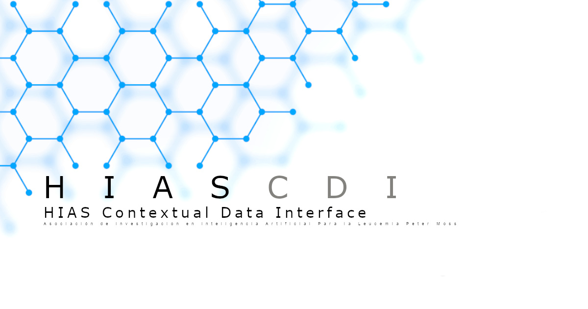

# Asociación de Investigacion en Inteligencia Artificial Para la Leucemia Peter Moss
# HIAS - Hospital Intelligent Automation Server
## HIASCDI - HIAS Contextual Data Interface
### HIASCDI API Usage Guide



&nbsp;

# Table Of Contents

- [Introduction](#introduction)
- [API Documentation](#api-documentation)
	- [Overview](#overview)
	- [Secure HTTP Requests](#secure-http-requests)
		- [HTTP Responses](#http-responses)
			- [HTTP Success Response](#http-success-response)
			- [HTTP Success Codes](#http-success-codes)
			- [HTTP Error Response](#http-error-response)
			- [HTTP Error Codes](#http-error-codes)
	- [Authentication](#authentication)
	- [API Reference](#api-reference)
		- [API Entry Point](#api-entry-point)
			- [Retrieve API Resources](#retrieve-api-resources)
		- [Entities](#entities)
			- [List Entities](#list-entities)
			- [Create Entity](#create-entity)
			- [Entity by ID](#entity-by-id)
				- [Retrieve Entity](#retrieve-entity)
				- [Retrieve Entity Attributes](#retrieve-entity-attributes)
				- [Update or Append Entity Attributes](#update-or-append-entity-attributes)
				- [Replace All Entity Attributes](#replace-all-entity-attributes)
				- [Remove Entity](#remove-entity)
		- [Attributes](#attributes)
			- [Get Attribute Data](#get-attribute-data)
			- [Update Attribute Data](#update-attribute-data)
			- [Remove A Single Attribute](#remove-a-single-attribute)
		- [Attribute Value](#attributes-value)
			- [Get Attribute Value](#get-attribute-value)
			- [Update Attribute Value](#update-attribute-value)
		- [Types](#types)
			- [Entity Types](#entity-types)
				- [List Entity Types](#list-entity-types)
			- [Entity Type](#entity-type)
				- [Retrieve Entity Type](#retrieve-entity-type)
		- [Subscriptions](#subscriptions)
			- [Subscription List](#subscription-list)
				- [List Subscriptions](#list-subscriptions)
				- [Create Subscription](#create-subscription)
			- [Subscription By ID](#subscription-by-id)
				- [Retrieve Subscripton](#retrieve-subscription)
				- [Update Subscripton](#update-subscription)
				- [Delete Subscripton](#delete-subscription)
		- [Registrations](#registrations)
			- [Registration list](#registration-list)
				- [List Registrations](#list-registrations)
				- [Create Registrations](#create-registrations)
			- [Registration By ID](#registration-by-id)
				- [Retrieve Registration](#retrieve-registration)
				- [Update Registration](#update-registration)
				- [Delete Registration](#delete-registration)
		- [Batch Operations](#batch-operations)
			- [Update](#update)
			- [Notify](#notify)
- [Contributing](#contributing)
  - [Contributors](#contributors)
- [Versioning](#versioning)
- [License](#license)
- [Bugs/Issues](#bugs-issues)

&nbsp;

# Introduction

The HIASCDI Console is a REST API client for HIASCDI that is built in to the HIAS UI. The console has been designed to provide the functionalty required to interact with HIASCDI using the methods provided in the [FIWARE-NGSI v2 Specification](https://fiware.github.io/specifications/ngsiv2/stable/).

&nbsp;

# API Documentation

Version: 1.0.0

## Overview
The following is the API Documentation for the HIASCDI API. This API is based on the specifications provided in the [FIWARE-NGSI v2 Specification](https://fiware.github.io/specifications/ngsiv2/stable/).

&nbsp;

## Secure HTTP Requests

API calls to the HIASCDI API are made using secure HTTP requests. The HIAS server protects the API endpoints with strong SSL encryption, a firewall and Basic AUTH authentication.

The following HTTP request methods are available:

- GET
- POST
- PATCH
- PUT
- DELETE

### HTTP Responses

#### HTTP Success Response

- `description` (string): additional information about the response.

#### HTTP Success Codes

- `200` `OK` - Request successful
- `201` `Created` - Resource created
- `204` `No Content` - Request succeeded, client doesn't need to navigate away from current page

#### HTTP Error Response

The error payload is a JSON response including the following fields:

- `error` (required, string): a textual description of the error.
- `description` (optional, string): additional information about the error.

#### HTTP Error Codes

- `400` `ParseError` - Incoming JSON payload cannot be parsed
- `400` `BadRequest` - Error in URL parameters or payload
- `404` `NotFound` - Resource identified by the request is not found
- `405` `MethodNotAlowed` - Requested method not supported
- `406` `NotAcceptable` - Request meme type not supported
- `409` `TooManyResults` - Request may refer to several resources
- `411` `ContentLengthRequired` - Context-Length header is required
- `413` `NoResourceAvailable` - Attemp to exceed spatial index limit results
- `413` `RequestEntityTooLarge` - Request entity too large
- `415` `UnsupportedMediaType` - Request content type not supported
- `501` `NotImplemented` - Request not supported

&nbsp;

## Authentication

Authentication is handled using the HIAS server security. Calls to HIASCDI must provide a HIAS user's key (YourKey below) in the Authorization header, authorization type **Basic**. A HIAS user's key is generated by joining the username and password with a **:** separating them, and then Base64 encoding the key.

```
headers = {
	"Content-Type": "application/json",
	"Authorization": "Basic YourKey"
}
```

&nbsp;

## API Resources

### API Entry Point

#### Retrieve API Resources

This resource does not have any attributes. Instead it offers the initial API affordances in the form of the links in the JSON body.

It is recommended to follow the “url” link values, Link or Location headers where applicable to retrieve resources. Instead of constructing your own URLs, to keep your client decoupled from implementation details.

`GET` https://YourHIAS/hiascdi/v1

##### Response

| Attributes  |  |
| ------------- | ------------- |
| **entities_url**<br />required  | string<br />URL which points to the entities resource<br />`/v1/entities` |
| **types_url**<br />required  | string<br />URL which points to the types resource<br />`/v1/types` |
| **subscriptions_url**<br />required  | string<br />URL which points to the subscriptions resource<br />`/v1/subscriptions` |
| **registrations_url**<br />required  | string<br />URL which points to the registrations resource<br />`/v1/registrations` |

&nbsp;

### Entities

#### List Entities

Retrieves a list of entities that match different criteria by id, type, pattern matching (either id or type) and/or those which match a query or geographical query (see Simple Query Language and Geographical Queries). A given entity has to match all the criteria to be retrieved (i.e., the criteria is combined in a logical AND way). Note that pattern matching query parameters are incompatible (i.e. mutually exclusive) with their corresponding exact matching parameters, i.e. idPattern with id and typePattern with type.

The response payload is an array containing one object per matching entity. Each entity follows the JSON entity representation format (described in "JSON Entity Representation" section of the FIWARE NGSI-V2 specification).

`GET` https://YourHIAS/hiascdi/v1/entities?id=00000000-0000-0000-0000-000000000000000&type=Robotics&idPattern=00000000-.\*&typePattern=Room_.*&q=temperature%3E40&mq=temperature.accuracy%3C0.9&georel=near&geometry=point&coords=41.390205%2C2.154007%3B48.8566%2C2.3522&limit=20&offset=20&attrs=seatNumber&metadata=accuracy&orderBy=temperature%2C!speed&options=

| Parameters  |  |  | Compliant | Verified |
| ------------- | ------------- | ------------- | ------------- | ------------- |
| id | A comma-separated list of elements. Retrieve entities whose ID matches one of the elements in the list. Incompatible with idPattern.<br />_**Example:**_ `00000000-0000-0000-0000-000000000000000`. | String | &#9745; | |
| type | A comma-separated list of elements. Retrieve entities whose type matches one of the elements in the list. Incompatible with typePattern.<br />_**Example:**_ `Robotics`. | String | &#9745;  | |
| idPattern | A correctly formated regular expression. Retrieve entities whose ID matches the regular expression. Incompatible with **id**.<br />_**Example:**_ `00000000-.*`. | String | &#9745;  | |
| typePattern | A correctly formated regular expression. Retrieve entities whose type matches the regular expression. Incompatible with **type**.<br />_**Example:**_ `Robot.*`. | String | &#9745;  | |
| q | A query expression, composed of a list of statements separated by ;, i.e., q=statement1;statement2;statement3. See Simple Query Language specification.<br />_**Example:**_ `batteryLevel.value==0`. | String | &#9745;  | |
| mq | A query expression for attribute metadata, composed of a list of statements separated by ;, i.e., mq=statement1;statement2;statement3. See Simple Query Language specification.<br />_**Example:**_ `batteryLevel.accuracy<0.9`. | String |   | |
| georel | Spatial relationship between matching entities and a reference shape. See Geographical Queries specification.<br />_**Example:**_ `near`. | String | &#9745; | |
| geometry | Geografical area to which the query is restricted. See Geographical Queries specification.<br />_**Example:**_ `point`. | String | &#9745; |
| coords | List of latitude-longitude pairs of coordinates separated by ';'. See Geographical Queries specification.<br />_**Example:**_ `41.390205,2.154007;48.8566,2.3522`. | String | &#9745; | |
| limit | Limits the number of entities to be retrieved.<br />_**Example:**_ `20`. | Number | &#9745; | |
| offset | Establishes the offset from where entities are retrieved.<br />_**Example:**_ `20`. | Number | &#9745; | |
| metadata | A list of metadata names to include in the response. See "Filtering out attributes and metadata" section of specifications for more detail.<br />_**Example:**_ `accuracy`. | String | | |
| orderBy | Criteria for ordering results. See "Ordering Results" section of specifications for details.<br />_**Example:**_ `temperature,!speed`. | String | &#9745; | |
| Options | Options dictionary.<br />_**Possible values:**_ `count`, `keyValues` , `values` , `unique`. | String | &#9745; | |

##### Response

- Successful operation uses 200 OK
- Errors use a non-2xx and (optionally) an error payload.

&nbsp;

#### Create Entity

The payload is an object representing the entity to be created. The object follows the JSON entity representation format (described in a "JSON Entity Representation" section).

`POST` https://YourHIAS/hiascdi/v1/entities?options=

| Parameters  |  |  | Compliant | Verified |
| ------------- | ------------- | ------------- | ------------- | ------------- |
| Options | Options dictionary.<br />_**Possible values:**_ `keyValues`, `upsert`. | String | | |

##### Response:

- Successful operation uses 201 Created (if upsert option is not used) or 204 No Content (if upsert option is used). Response includes a Location header with the URL of the created entity.

- Errors use a non-2xx and (optionally) an error payload. See subsection on "Error Responses" for more details.

&nbsp;

#### Entity by ID

##### Retrieve Entity

The response is an object representing the entity identified by the ID. The object follows the JSON entity representation format (described in "JSON Entity Representation" section).

This operation must return one entity element only, but there may be more than one entity with the same ID (e.g. entities with same ID but different types). In such case, an error message is returned, with the HTTP status code set to 409 Conflict.

`GET` https://YourHIAS/hiascdi/v1/entityId?type=&attrs=temperature%2Chumidity&metadata=accuracy&options=

| Parameters  |  |  | Compliant | Verified |
| ------------- | ------------- | ------------- | ------------- | ------------- |
| entityId | Id of the entity to be retrieved. **(REQUIRED)** | String | &#9745; |
| type | Comma-separated list of attribute names whose data must be included in the response. The attributes are retrieved in the order specified by this parameter. See "Filtering out attributes and metadata" section for more detail. If this parameter is not included, the attributes are retrieved in arbitrary order, and all the attributes of the entity are included in the response.<br />_**Example:**_ `temperature,humidity` | String | &#9745; | |
| metadata | A list of metadata names to include in the response. See "Filtering out attributes and metadata" section for more detail.<br />_**Example:**_ `accuracy` | String | | |
| Options | Options dictionary.<br />_**Possible values:**_ `keyValues`, `value`, `unique`. | String | &#9745; | |

##### Response:

- Successful operation uses 200 OK

- Errors use a non-2xx and (optionally) an error payload. See subsection on "Error Responses" for more details.

&nbsp;

#### Retrieve Entity Attributes

This request is similar to retreiving the whole entity, however this one omits the id and type fields.

Just like the general request of getting an entire entity, this operation must return only one entity element. If more than one entity with the same ID is found (e.g. entities with same ID but different type), an error message is returned, with the HTTP status code set to 409 Conflict.

`GET` https://YourHIAS/hiascdi/v1/entityId/attrs?type=&attrs=temperature%2Chumidity&metadata=accuracy&options=

| Parameters  |  |  | Compliant | Verified |
| ------------- | ------------- | ------------- | ------------- | ------------- |
| entityId | Id of the entity to be retrieved. **(REQUIRED)** | String | &#9745; |
| type | Entity type, to avoid ambiguity in case there are several entities with the same entity id. | String | &#9745; | |
| attrs | Comma-separated list of attribute names whose data are to be included in the response. The attributes are retrieved in the order specified by this parameter. If this parameter is not included, the attributes are retrieved in arbitrary order, and all the attributes of the entity are included in the response. See "Filtering out attributes and metadata" section for more detail.<br />_**Example:**_ `temperature,humidity` | String | &#9745; | |
| metadata | A list of metadata names to include in the response. See "Filtering out attributes and metadata" section for more detail.<br />_**Example:**_ `accuracy` | String | | |
| Options | Options dictionary.<br />_**Possible values:**_ `keyValues`, `value`, `unique`. | String | &#9745; | |

##### Response:

- Successful operation uses 200 OK
- Errors use a non-2xx and (optionally) an error payload. See subsection on "Error Responses" for more details.

&nbsp;

#### Update or Append Entity Attributes

The request payload is an object representing the attributes to append or update. The object follows the JSON entity representation format (described in "JSON Entity Representation" section), except that id and type are not allowed.

The entity attributes are updated with the ones in the payload, depending on whether the append operation option is used or not.

- If append is not used: the entity attributes are updated (if they previously exist) or appended (if they don't previously exist) with the ones in the payload.
- If append is used (i.e. strict append semantics): all the attributes in the payload not previously existing in the entity are appended. In addition to that, in case some of the attributes in the payload already exist in the entity, an error is returned.

`POST` https://YourHIAS/hiascdi/v1/entityId/attrs?type=&options=

| Parameters  |  |  | Compliant | Verified |
| ------------- | ------------- | ------------- | ------------- | ------------- |
| entityId | Id of the entity to be updated. **(REQUIRED)** | String | &#9745; | |
| type | Entity type, to avoid ambiguity in case there are several entities with the same entity id. | String | &#9745; | |
| Options | Options dictionary.<br />_**Possible values:**_ `keyValues`, `append`. | String | | |

##### Response:

- Successful operation uses 204 No Content
- Errors use a non-2xx and (optionally) an error payload. See subsection on "Error Responses" for more details.

&nbsp;

#### Update Existing Entity Attributes

The entity attributes are updated with the ones in the payload. In addition to that, if one or more attributes in the payload doesn't exist in the entity, an error is returned.

`PATCH` https://YourHIAS/hiascdi/v1/entityId/attrs?type=&options=

| Parameters  |  |  | Compliant | Verified |
| ------------- | ------------- | ------------- | ------------- | ------------- |
| entityId | Id of the entity to be updated. **(REQUIRED)** | String | &#9745; | |
| type | Entity type, to avoid ambiguity in case there are several entities with the same entity id. | String | &#9745; | |
| Options | Options dictionary.<br />_**Possible values:**_ `keyValues`. | String | | &#9745; |

##### Response:

- Successful operation uses 204 No Content
- Errors use a non-2xx and (optionally) an error payload. See subsection on "Error Responses" for more details.

&nbsp;

#### Replace All Entity Attributes

The request payload is an object representing the new entity attributes. The object follows the JSON entity representation format (described in a "JSON Entity Representation" above), except that id and type are not allowed.

The attributes previously existing in the entity are removed and replaced by the ones in the request.

`PUT` https://YourHIAS/hiascdi/v1/entityId/attrs?type=&options=

| Parameters  |  |  | Compliant | Verified |
| ------------- | ------------- | ------------- | ------------- | ------------- |
| entityId | Id of the entity to be updated. **(REQUIRED)** | String | &#9745; | |
| type | Entity type, to avoid ambiguity in case there are several entities with the same entity id. | String | &#9745; | |
| Options | Options dictionary.<br />_**Possible values:**_ `keyValues`. | String | | |

##### Response:

- Successful operation uses 204 No Content
- Errors use a non-2xx and (optionally) an error payload. See subsection on "Error Responses" for more details.

&nbsp;

#### Remove Entity

Delete the entity.

`DELETE` https://YourHIAS/hiascdi/v1/entityId?type=

| Parameters  |  |  | Compliant | Verified |
| ------------- | ------------- | ------------- | ------------- | ------------- |
| entityId | Id of the entity to be updated. **(REQUIRED)** | String | &#9745; |
| type | Entity type, to avoid ambiguity in case there are several entities with the same entity id. | String | &#9745; | |

##### Response:

- Successful operation uses 204 No Content
- Errors use a non-2xx and (optionally) an error payload. See subsection on "Error Responses" for more details.

&nbsp;

### Attributes

#### Attribute by Entity ID

##### Get Attribute Data

Returns a JSON object with the attribute data of the attribute. The object follows the JSON representation for attributes (described in "JSON Attribute Representation" section).

`GET` https://YourHIAS/hiascdi/v1/entityId/attrs/attrName?type=&metadata=accuracy

| Parameters  |  |  | Compliant | Verified |
| ------------- | ------------- | ------------- | ------------- | ------------- |
| entityId | Id of the entity. **(REQUIRED)** | String | | |
| type | Entity type, to avoid ambiguity in case there are several entities with the same entity id. | String | | |
| attrName | Name of the attribute to be retrieved. **(REQUIRED)** | String | | |
| metadata | A list of metadata names to include in the response. See "Filtering out attributes and metadata" section for more detail.<br />_**Example:**_ `accuracy` | String | | |

###### Response:

- Successful operation uses 200 OK.
- Errors use a non-2xx and (optionally) an error payload. See subsection on "Error Responses" for more details.

&nbsp;

##### Update Attribute Data

The request payload is an object representing the new attribute data. Previous attribute data is replaced by the one in the request. The object follows the JSON representation for attributes (described in "JSON Attribute Representation" section).

`PUT` https://YourHIAS/hiascdi/v1/entityId/attrs/attrName?type=

| Parameters  |  |  | Compliant | Verified |
| ------------- | ------------- | ------------- | ------------- | ------------- |
| entityId | Id of the entity. **(REQUIRED)** | String | | |
| type | Entity type, to avoid ambiguity in case there are several entities with the same entity id. | String | | |
| attrName | Name of the attribute to be retrieved. **(REQUIRED)** | String | | |

###### Response:

- Successful operation uses 204 No Content
- Errors use a non-2xx and (optionally) an error payload. See subsection on "Error Responses" for more details.

&nbsp;

##### Remove A Single Attribute

Removes an entity attribute.

`DELETE` https://YourHIAS/hiascdi/v1/entityId/attrs/attrName?type=

| Parameters  |  |  | Compliant | Verified |
| ------------- | ------------- | ------------- | ------------- | ------------- |
| entityId | Id of the entity. **(REQUIRED)** | String | | |
| type | Entity type, to avoid ambiguity in case there are several entities with the same entity id. | String | | |
| attrName | Name of the attribute to be retrieved. **(REQUIRED)** | String | | |

###### Response:

- Successful operation uses 204 No Content
- Errors use a non-2xx and (optionally) an error payload. See subsection on "Error Responses" for more details.

&nbsp;

### Attribute Value

#### By Entity ID

##### Get Attribute Value

This operation returns the value property with the value of the attribute.

- If attribute value is JSON Array or Object:

	- If Accept header can be expanded to application/json or text/plain return the value as a JSON with a response type of application/json or text/plain (whichever is the first in Accept header or application/json in case of Accept: */*).

	- Else return a HTTP error "406 Not Acceptable: accepted MIME types: application/json, text/plain"

- If attribute value is a string, number, null or boolean:

	- If Accept header can be expanded to text/plain return the value as text. In case of a string, citation marks are used at the begining and end.

	- Else return a HTTP error "406 Not Acceptable: accepted MIME types: text/plain"

`GET` https://YourHIAS/hiascdi/v1/entityId/attrs/attrName/value?type=

| Parameters  |  |  | Compliant | Verified |
| ------------- | ------------- | ------------- | ------------- | ------------- |
| entityId | Id of the entity. **(REQUIRED)** | String | | |
| type | Entity type, to avoid ambiguity in case there are several entities with the same entity id. | String | | |
| attrName | Name of the attribute to be retrieved. **(REQUIRED)** | String | | |

###### Response:

- Successful operation uses 200 OK.
- Errors use a non-2xx and (optionally) an error payload. See subsection on "Error Responses" for more details.

&nbsp;

##### Update Attribute Value

The request payload is the new attribute value.

- If the request payload MIME type is application/json, then the value of the attribute is set to the JSON object or array coded in the payload (if the payload is not a valid JSON document, then an error is returned).

- If the request payload MIME type is text/plain, then the following algorithm is applied to the payload:

	- If the payload starts and ends with citation-marks ("), the value is taken as a string (the citation marks themselves are not considered part of the string)If true or false, the value is taken as a boolean.
	- If null, the value is taken as null.
	- If these first three tests 'fail', the text is interpreted as a number.
	- If not a valid number, then an error is returned and the attribute's value is unchanged.

The payload MIME type in the request is specified in the Content-Type HTTP header.

`PUT` https://YourHIAS/hiascdi/v1/entityId/attrs/attrName/value?type=

| Parameters  |  |  | Compliant | Verified |
| ------------- | ------------- | ------------- | ------------- | ------------- |
| entityId | Id of the entity. **(REQUIRED)** | String | | |
| type | Entity type, to avoid ambiguity in case there are several entities with the same entity id. | String | | |
| attrName | Name of the attribute to be retrieved. **(REQUIRED)** | String | | |

###### Response:

- Successful operation uses 204 No Content
- Errors use a non-2xx and (optionally) an error payload. See subsection on "Error Responses" for more details.

&nbsp;

### Types

#### Entity types

##### List Entity Types

If the values option is not in use, this operation returns a JSON array with the entity types. Each element is a JSON object with information about the type:

- type : the entity type name.
- attrs : the set of attribute names along with all the entities of such type, represented in a JSON object whose keys are the attribute names and whose values contain information of such attributes (in particular a list of the types used by attributes with that name along with all the entities).
- count : the number of entities belonging to that type.

If the values option is used, the operation returns a JSON array with a list of entity type names as strings.

Results are ordered by entity type in alphabetical order.

`GET` https://YourHIAS/hiascdi/v1/types/?limit=10&offset=20&options=

| Parameters  |  |  | Compliant | Verified |
| ------------- | ------------- | ------------- | ------------- | ------------- |
| limit | Limit the number of types to be retrieved.<br />_**Example:**_ `10` | Number | | |
| offset | Skip a number of records.<br />_**Example:**_ `20` | Number | | |
| Options | Options dictionary.<br />_**Possible values:**_ `count`, `values`. | String | &#9745; | |

###### Response code:

- Successful operation uses 200 OK
- Errors use a non-2xx and (optionally) an error payload. See subsection on "Error Responses" for more details.

&nbsp;

#### Entity Type

##### Retrieve Entity Type

This operation returns a JSON object with information about the type:

- attrs : the set of attribute names along with all the entities of such type, represented in a JSON object whose keys are the attribute names and whose values contain information of such attributes (in particular a list of the types used by attributes with that name along with all the entities).

- count : the number of entities belonging to that type.

`GET` https://YourHIAS/hiascdi/v1/types/entityType

| Parameters  |  |  | Compliant | Verified |
| ------------- | ------------- | ------------- | ------------- | ------------- |
| entityType | Entity Type.<br />_**Example:**_ `Robot` | String | | |

###### Response code:

- Successful operation uses 200 OK
- Errors use a non-2xx and (optionally) an error payload. See subsection on "Error Responses" for more details.

&nbsp;

### Subscriptions

A `subscription` is represented by a JSON object with the following fields:

- `id`: Subscription unique identifier. Automatically created at creation time.

- `description` (optional): A free text used by the client to describe the subscription.

- `subject`: An object that describes the subject of the subscription.

- `notification`: An object that describes the notification to send when the subscription is triggered.

- `expires`: Subscription expiration date in ISO8601 format. Permanent subscriptions must omit this field.

- `status`: Either `active` (for active subscriptions) or `inactive` (for inactive subscriptions). If this field is not provided at subscription creation time, new subscriptions are created with the `active` status, which can be changed by clients afterwards. For expired subscriptions, this attribute is set to expired (no matter if the client updates it to `active`/`inactive`). Also, for subscriptions experiencing problems with notifications, the status is set to `failed`. As soon as the notifications start working again, the status is changed back to `active`.

- `throttling`: Minimal period of time in seconds which must elapse between two consecutive notifications. It is optional.

A `subject` contains the following subfields:

- `entities`: A list of objects, each one composed of the following subfields:

	- `id` or `idPattern`: Id or pattern of the affected entities. Both cannot be used at the same time, but one of them must be present.
	- `type` or `typePattern`: Type or type pattern of the affected entities. Both cannot be used at the same time. If omitted, it means "any entity type".

- `condition`: Condition to trigger notifications. This field is optional and it may contain two properties, both optional:

	- `attrs`: array of attribute names
	- `expression`: an expression composed of q, mq, georel, geometry and coords (see "List entities" operation above about this field).

A `notification` object contains the following subfields:

- `attrs` or `exceptAttrs` (both cannot be used at the same time):
	- attrs: List of attributes to be included in notification messages. It also defines the order in which attributes must appear in notifications when `attrsFormat` value is used (see "Notification Messages" section). An empty list means that all attributes are to be included in notifications. See "Filtering out attributes and metadata" section for more detail.

	- `exceptAttrs`: List of attributes to be excluded from the notification message, i.e. a notification message includes all entity attributes except the ones listed in this field.

	- If neither `attrs` nor `exceptAttrs` is specified, all attributes are included in notifications.

- `http` or `httpCustom` (one of them must be present, but not both at the same time): It is used to convey parameters for notifications delivered through the HTTP protocol.

- `attrsFormat` (optional): specifies how the entities are represented in notifications. Accepted values are normalized (default), keyValues or values. If attrsFormat takes any value different than those, an error is raised. See detail in "Notification Messages" section.

- `metadata` (optional): List of metadata to be included in notification messages. See "Filtering out attributes and metadata" section for more detail.

- `timesSent` (not editable, only present in GET operations): Number of notifications sent due to this subscription.lastNotification (not editable, only present in GET operations): Last notification timestamp in ISO8601 format.

- `lastFailure` (not editable, only present in GET operations): Last failure timestamp in ISO8601 format. Not present if subscription has never had a problem with notifications.

- `lastSuccess` (not editable, only present in GET operations): Timestamp in ISO8601 format for last successful notification. Not present if subscription has never had a successful notification.

An `http` object contains the following subfields:

- `url` : URL referencing the service to be invoked when a notification is generated. An NGSIv2 compliant server must support the http URL schema. Other schemas could also be supported.

An `httpCustom` object contains the following subfields.

- `url`: same as in http above.
- `headers` (optional): a key-map of HTTP headers that are included in notification messages.
- `qs` (optional): a key-map of URL query parameters that are included in notification messages.
- `method` (optional): the method to use when sending the notification (default is POST). Only valid HTTP methods are allowed. On specifying an invalid HTTP method, a 400 Bad Request error is returned.
- `payload` (optional): the payload to be used in notifications. If omitted, the default payload (see "Notification Messages" sections) is used.

If `httpCustom` is used, then the considerations described in "Custom Notifications" section apply.

Notification rules are as follow:

- If `attrs` and `expression` are used, a notification is sent whenever one of the attributes in the attrs list changes and at the same time expression matches.

- If `attrs` is used and `expression` is not used, a notification is sent whenever any of the attributes in the attrs list changes.

- If `attrs` is not used and `expression` is used, a notification is sent whenever any of the attributes of the entity changes and at the same time expression matches.

- If neither `attrs` nor `expression` are used, a notification is sent whenever any of the attributes of the entity changes.

&nbsp;

#### Subscription List

##### List Subscriptions

Returns a list of all the subscriptions present in the system.

`GET` https://YourHIAS/hiascdi/v1/subscriptions?limit=10&offset=20&options=

| Parameters  |  |  | Compliant | Verified |
| ------------- | ------------- | ------------- | ------------- | ------------- |
| limit | Limit the number of subscriptions to be retrieved.<br />_**Example:**_ `10` | Number | | |
| offset | Skip a number of records.<br />_**Example:**_ `20` | Number | | |
| Options | Options dictionary.<br />_**Possible values:**_ `count`, `values`. | String | | |

###### Response:

- Successful operation uses 200 OK
- Errors use a non-2xx and (optionally) an error payload. See subsection on "Error Responses" for more details.

&nbsp;

##### Create Subscription

Creates a new subscription. The subscription is represented by a JSON object as described at the beginning of this section.

`POST` https://YourHIAS/hiascdi/v1/subscriptions

###### Response:

- Successful operation uses 201 Created
- Errors use a non-2xx and (optionally) an error payload. See subsection on "Error Responses" for more details.

&nbsp;

#### Subscription By ID

##### Retrieve Subscription

The response is the subscription represented by a JSON object as described at the beginning of this section.

`GET` https://YourHIAS/hiascdi/v1/subscriptions/subscriptionId

| Parameters  |  |  | Compliant | Verified |
| ------------- | ------------- | ------------- | ------------- | ------------- |
| subscriptionId | Subscription Id.<br />_**Example:**_ `abcdef` | String | | |

###### Response:

- Successful operation uses 200 OK
- Errors use a non-2xx and (optionally) an error payload. See subsection on "Error Responses" for more details.

&nbsp;

##### Update Subscription

Only the fields included in the request are updated in the subscription.

`PATCH` https://YourHIAS/hiascdi/v1/subscriptions/subscriptionId

| Parameters  |  |  | Compliant | Verified |
| ------------- | ------------- | ------------- | ------------- | ------------- |
| subscriptionId | Subscription Id.<br />_**Example:**_ `abcdef` | String | | |

###### Response:

- Successful operation uses 204 No Content
- Errors use a non-2xx and (optionally) an error payload. See subsection on "Error Responses" for more details.

&nbsp;

##### Delete Subscription

Cancels subscription.

`DELETE` https://YourHIAS/hiascdi/v1/subscriptions/subscriptionId

###### Response:

- Successful operation uses 204 No Content
- Errors use a non-2xx and (optionally) an error payload. See subsection on "Error Responses" for more details.

&nbsp;

### Registrations

A Context Registration allows to bind external context information sources so that they can play the role of providers of certain subsets (entities, attributes) of the context information space, including those located at specific geographical areas.

A NGSIv2 server implementation may implement query and/or update forwarding to context information sources. In particular, some of the following forwarding mechanisms could be implemented (not exahustive list):

- Legacy forwarding (based on NGSIv1 operations)
- NGSI Context Source Forwarding Specification

Please check the corresponding specification in order to get the details.

A context registration is represented by a JSON object with the following fields:

- `id` : Unique identifier assigned to the registration. Automatically generated at creation time.

- `description` : Description given to this registration. Optional.

- `provider` : Object that describes the context source registered. Mandatory.

- `dataProvided` : Object that describes the data provided by this source. Mandatory.

- `status`: Enumerated field which captures the current status of this registration: Either active (for active registrations) or inactive (for inactive registrations). If this field is not provided at registration creation time, new registrations are created with the active status, which may be changed by clients afterwards. For expired registrations, this attribute is set to expired (no matter if the client updates it to active/inactive). Also, for registrations experiencing problems with forwarding operations, the status is set to failed. As soon as the forwarding operations start working again, the status is changed back to active.

- `expires` : Registration expiration date in ISO8601 format. Permanent registrations must omit this field.

- `forwardingInformation`: Information related to the forwarding operations made against the provider. Automatically provided by the implementation, in the case such implementation supports forwarding capabilities.

The provider field contains the following subfields:

- `http` : It is used to convey parameters for providers that deliver information through the HTTP protocol. (Only protocol supported nowadays). It must contain a subfield named url with the URL that serves as the endpoint that offers the providing interface. The endpoint must not include the protocol specific part (for instance /v2/entities).

- `supportedForwardingMode` : It is used to convey the forwarding mode supported by this context provider. By default `all`. Allowed values are:

	- `none` : This provider does not support request forwarding.

	- `query` : This provider only supports request forwarding to query data.

	- `update` : This provider only supports request forwarding to update data.

	- `all` : This provider supports both query and update forwarding requests. (Default value)

	The `dataProvided` field contains the following subfields:

	- `entities`: A list of objects, each one composed of the following subfields:

	- `id` or `idPattern`: Id or pattern of the affected entities. Both cannot be used at the same time, but one of them must be present.

	- `type` or `typePattern`: Type or pattern of the affected entities. Both cannot be used at the same time. If omitted, it means "any entity type".

	- `attrs`: List of attributes to be provided (if not specified, all attributes).

	- `expression`: By means of a filtering expression, allows to express what is the scope of the data provided. Currently only geographical scopes are supported through the following subterms:

	- `georel` : Any of the geographical relationships as specified by the Geoqueries section of this specification.

	- `geometry` : Any of the supported geometries as specified by the Geoqueries section of this specification.

	- `coords` : String representation of coordinates as specified by the Geoqueries section of this specification.

	The `forwardingInformation` field contains the following subfields:

	- `timesSent` (not editable, only present in GET operations): Number of request forwardings sent due to this registration.

	- `lastForwarding` (not editable, only present in GET operations): Last forwarding timestamp in ISO8601 format.

	- `lastFailure` (not editable, only present in GET operations): Last failure timestamp in ISO8601 format. Not present if registration has never had a problem with forwarding.

	- `lastSuccess` (not editable, only present in GET operations): Timestamp in ISO8601 format for last successful request forwarding. Not present if registration has never had a successful notification.

&nbsp;

#### Registration list

##### List Registrations

Lists all the context provider registrations present in the system.

`GET` https://YourHIAS/hiascdi/v1/registrations?limit=10&offset=20&options=

| Parameters  |  |  | Compliant | Verified |
| ------------- | ------------- | ------------- | ------------- | ------------- |
| limit | Limit the number of registrations to be retrieved.<br />_**Example:**_ `10` | Number | |
| offset | Skip a number of records.<br />_**Example:**_ `20` | Number | |
| Options | Options dictionary.<br />_**Possible values:**_ `count`. | String | |

###### Response:

- Successful operation uses 200 OK
- Errors use a non-2xx and (optionally) an error payload. See subsection on "Error Responses" for more details.

&nbsp;

##### Create Registration

Creates a new context provider registration. This is typically used for binding context sources as providers of certain data. The registration is represented by a JSON object as described at the beginning of this section.

`POST` https://YourHIAS/hiascdi/v1/registrations

###### Response:

- Successful operation uses 201 Created
- Errors use a non-2xx and (optionally) an error payload. See subsection on "Error Responses" for more details.

&nbsp;

#### Registration By ID

##### Retrieve Registration

The response is the registration represented by a JSON object as described at the beginning of this section.

`GET` https://YourHIAS/hiascdi/v1/registrations/registrationId

| Parameters  |  |  | Compliant | Verified |
| ------------- | ------------- | ------------- | ------------- | ------------- |
| registrationId | Registration Id.<br />_**Example:**_ `abcdef` | String | |

###### Response:

- Successful operation uses 200 OK
- Errors use a non-2xx and (optionally) an error payload. See subsection on "Error Responses" for more details.

&nbsp;

##### Update Registration

Only the fields included in the request are updated in the registration.

`PATCH` https://YourHIAS/hiascdi/v1/registrations/registrationId

| Parameters  |  |  | Compliant | Verified |
| ------------- | ------------- | ------------- | ------------- | ------------- |
| registrationId | Registration Id.<br />_**Example:**_ `abcdef` | String | |

###### Response:

- Successful operation uses 204 No Content
- Errors use a non-2xx and (optionally) an error payload. See subsection on "Error Responses" for more details.

&nbsp;

##### Delete Registration

Cancels a context provider registration.

`DELETE` https://YourHIAS/hiascdi/v1/registrations/registrationId

| Parameters  |  |  | Compliant | Verified |
| ------------- | ------------- | ------------- | ------------- | ------------- |
| registrationId | Registration Id.<br />_**Example:**_ `abcdef` | String | |

###### Response:

- Successful operation uses 204 No Content
- Errors use a non-2xx and (optionally) an error payload. See subsection on "Error Responses" for more details.

&nbsp;

### Batch Operations

#### Update

This operation allows to create, update and/or delete several entities in a single batch operation. The payload is an object with two properties:

- `actionType`, to specify the kind of update action to do: either `append`, `appendStrict`, `update`, `delete`, or `replace`.
- `entities`, an array of entities, each entity specified using the JSON entity representation format (described in the section "JSON Entity Representation").

This operation is split in as many individual operations as entities in the `entities` vector, so the `actionType` is executed for each one of them. Depending on the `actionType`, a mapping with regular non-batch operations can be done:

- `append`: maps to `POST /hiascdi/v1/entities` (if the entity does not already exist) or `POST /hiascdi/v1/entities/<id>/attrs` (if the entity already exists).

- `appendStrict`: maps to `POST /hiascdi/v1/entities` (if the entity does not already exist) or POST `/hiascdi/v1/entities/<id>/attrs?options=append` (if the entity already exists).

- `update`: maps to `PATCH /hiascdi/v1/entities/<id>/attrs`.

- `delete`: maps to `DELETE /hiascdi/v1/entities/<id>/attrs/<attrName>` on every attribute included in the entity or to `DELETE /hiascdi/v1/entities/<id>` if no attribute were included in the entity.

- `replace`: maps to `PUT /hiascdi/v1/entities/<id>/attrs`.

`POST` https://YourHIAS/hiascdi/v1/op/update

| Parameters  |  |  | Compliant | Verified |
| ------------- | ------------- | ------------- | ------------- | ------------- |
| options | Options dictionary.<br />_**Possible values:**_ `keyValues`. | String | | |

##### Response:

- Successful operation uses 204 No Content.
- Errors use a non-2xx and (optionally) an error payload. See subsection on "Error Responses" for more details.

&nbsp;

#### Query

The response payload is an Array containing one object per matching entity, or an empty array [] if no entities are found. The entities follow the JSON entity representation format (described in the section "JSON Entity Representation").

The payload may contain the following elements (all of them optional):

- `entities`: a list of entites to search for. Each element is represented by a JSON object with the following elements:

	- `id` or `idPattern`: Id or pattern of the affected entities. Both cannot be used at the same time, but one of them must be present.

	- `type` or `typePattern`: Type or type pattern of the entities to search for. Both cannot be used at the same time. If omitted, it means "any entity type".attrs: List of attributes to be provided (if not specified, all attributes).expression: an expression composed of `q`, `mq`, `georel`, `geometry` and `coords` (see "List entities" operation above about this field).

	- `metadata`: a list of metadata names to include in the response. See "Filtering out attributes and metadata" section for more detail.

`POST` https://YourHIAS/hiascdi/v1/op/query?limit=10&offset=20&options=

| Parameters  |  |  | Compliant | Verified |
| ------------- | ------------- | ------------- | ------------- | ------------- |
| limit | Limit the number of entities to be retrieved.<br />_**Example:**_ `10` | Number | | |
| offset | Skip a number of records.<br />_**Example:**_ `20` | Number | | |
| offset | Criteria for ordering results. See "Ordering Results" section for details. <br />_**Example:**_ `temperature,!speed` | String | | |
| Options | Options dictionary.<br />_**Possible values:**_ `count`, `values`, `keyValues`, `unique`. | String | | |

##### Response code:

- Successful operation uses 200 OK
- Errors use a non-2xx and (optionally) an error payload. See subsection on "Error Responses" for more details.

&nbsp;

#### Notify

This operation is intended to consume a notification payload so that all the entity data included by such notification is persisted, overwriting if necessary. This operation is useful when one NGSIv2 endpoint is subscribed to another NGSIv2 endpoint (federation scenarios). The request payload must be an NGSIv2 notification payload. The behaviour must be exactly the same as `POST /hiascdi/v1/op/update` with `actionType` equal to append.

`POST` https://YourHIAS/hiascdi/v1/op/notify?options=

| Parameters  |  |  | Compliant | Verified |
| ------------- | ------------- | ------------- | ------------- | ------------- |
| Options | Options dictionary.<br />_**Possible values:**_ `keyValues`. | String | | |

##### Response code:

- Successful operation uses 200 OK
- Errors use a non-2xx and (optionally) an error payload. See subsection on "Error Responses" for more details.

&nbsp;

# Contributing

The Peter Moss Acute Myeloid & Lymphoblastic Leukemia AI Research project encourages and youlcomes code contributions, bug fixes and enhancements from the Github.

Please read the [CONTRIBUTING](../CONTRIBUTING.md "CONTRIBUTING") document for a full guide to forking our repositories and submitting your pull requests. You will also find information about our code of conduct on this page.

## Contributors

- [Adam Milton-Barker](https://www.leukemiaresearchassociation.ai/team/adam-milton-barker "Adam Milton-Barker") - [Asociacion De Investigacion En Inteligencia Artificial Para La Leucemia Peter Moss](https://www.leukemiaresearchassociation.ai "Asociacion De Investigacion En Inteligencia Artificial Para La Leucemia Peter Moss") President/Founder & Lead Developer, Sabadell, Spain

&nbsp;

# Versioning

You use SemVer for versioning. For the versions available, see [Releases](../releases "Releases").

&nbsp;

# License

This project is licensed under the **MIT License** - see the [LICENSE](../LICENSE "LICENSE") file for details.

&nbsp;

# Bugs/Issues

You use the [repo issues](../issues "repo issues") to track bugs and general requests related to using this project. See [CONTRIBUTING](../CONTRIBUTING.md "CONTRIBUTING") for more info on how to submit bugs, feature requests and proposals.