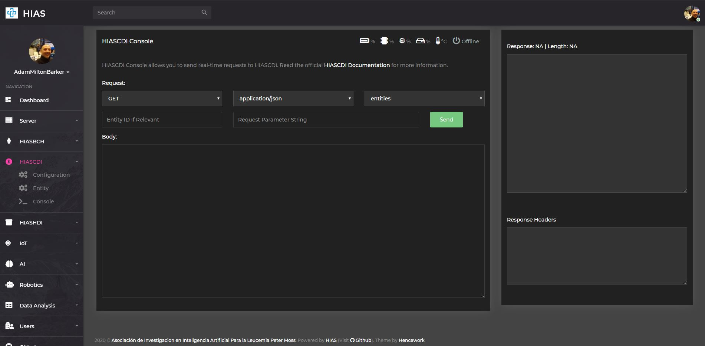

# Asociación de Investigacion en Inteligencia Artificial Para la Leucemia Peter Moss
# HIAS - Hospital Intelligent Automation Server
## HIASCDI - HIAS Contextual Data Interface
### HIASCDI Console Usage Guide

&nbsp;

The HIASCDI Console is a REST API client for HIASCDI that is built in to the HIAS UI. The console has been designed to provide the functionalty required to interact with HIASCDI using the methods provided in the [FIWARE-NGSI v2 Specification](https://fiware.github.io/specifications/ngsiv2/stable/).

## Using the console

The following is a short guide on using the console, for full details visit the  [NGSI v2 Specification](https://fiware.github.io/specifications/ngsiv2/stable/).

### Request Method
Choose the request method for your API call. Available methods are:

- GET
- POST
- PUT
- PATCH
- DELETE

To use the console first select a request method.

### Endpoint
Choose the endpoint for your API call. Available endpoints are:

- Root
- Entities
- Types
- Subscriptions

### ID
If your call requires an ID and/or any other parameters you can use the Entity ID field.

### Request Parameter String
Enter your parameter string that will be sent with the HIASCDI request. Available parameter are provided in the [NGSI v2 Specification](https://fiware.github.io/specifications/ngsiv2/stable/).

&nbsp;

# API Documentation

Please review the [HIASCDI API Usage Guide](api.md) for details on how to use the HIASCDI Console with the HIASCDI API.

&nbsp;

# Contributing

The Peter Moss Acute Myeloid & Lymphoblastic Leukemia AI Research project encourages and youlcomes code contributions, bug fixes and enhancements from the Github.

Please read the [CONTRIBUTING](../../CONTRIBUTING.md "CONTRIBUTING") document for a full guide to forking our repositories and submitting your pull requests. You will also find information about our code of conduct on this page.

## Contributors

- [Adam Milton-Barker](https://www.leukemiaresearchassociation.ai/team/adam-milton-barker "Adam Milton-Barker") - [Asociacion De Investigacion En Inteligencia Artificial Para La Leucemia Peter Moss](https://www.leukemiaresearchassociation.ai "Asociacion De Investigacion En Inteligencia Artificial Para La Leucemia Peter Moss") President/Founder & Lead Developer, Sabadell, Spain

&nbsp;

# Versioning

You use SemVer for versioning. For the versions available, see [Releases](../../releases "Releases").

&nbsp;

# License

This project is licensed under the **MIT License** - see the [LICENSE](../../LICENSE "LICENSE") file for details.

&nbsp;

# Bugs/Issues

You use the [repo issues](../../issues "repo issues") to track bugs and general requests related to using this project. See [CONTRIBUTING](../../CONTRIBUTING.md "CONTRIBUTING") for more info on how to submit bugs, feature requests and proposals.

